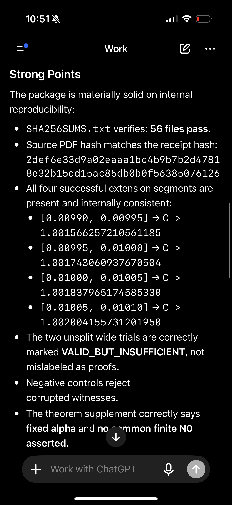

# Two-Block BH MPFR Replay Certificate — Alpha-Interval Extension [0.00990, 0.01010]

**Prepared by:** Grounded DI LLC / Mark S. Weinstein  
**System:** MathWise DI²  
**Date:** October 8, 2026  
**Record type:** Deterministic numerical replay certificate and source-level audit  
**Verification scope:** 256-bit directed-rounding MPFR; not Lean kernel-verified.

This package records a new MPFR reconstruction of the July 15, 2026 two-block Gaussian Benjamini–Hochberg technical draft, with executable witnesses, a separately written verifier, execution receipts, and retained unsuccessful trials. The extension certifies the nominal-level interval **[0.00990, 0.01010]** through four closed subintervals.

[Download the original certificate archive](BH_TwoBlock_MPFR_Audit_Extension_2026-10-08.zip).

## Result and quantifiers

For the fixed Gaussian model specified in the archive's theorem supplement, the reported certificate establishes, for **each fixed** alpha in [0.00990, 0.01010],

```text
liminf_(N → infinity) FDR_(N, alpha) ≥ alpha · C_*
C_* > 1.0015662572105611 > 1
```

Consequently, for every fixed alpha in that interval, there exists N0(alpha) such that FDR_(N, alpha) > alpha for all N ≥ N0(alpha). The result supplies neither a numerical finite-N threshold nor a common finite N0 across the entire interval.

| Closed alpha interval | Reported rigorous coefficient lower bound |
|---|---:|
| [0.00990, 0.00995] | 1.001566257210561185 |
| [0.00995, 0.01000] | 1.001743060937670504 |
| [0.01000, 0.01005] | 1.001837965174585330 |
| [0.01005, 0.01010] | 1.002004155731201950 |

The Gaussian model is unchanged. The advancement is a wider certified alpha interval and a new reproducibility package. The archive also records the alpha = 0.01 lower bound 0.010155532664618129… and reproduction of the original [0.00998, 0.01002] interval.

## Contents and integrity

The unchanged ZIP contains the source PDF, original package README, theorem supplement, technical review, MPFR arithmetic wrapper, generator, separate verifier, eight witness files, execution logs, negative controls, environment record, receipt, and SHA-256 manifest. Its internal manifest covers 56 files.

Archive SHA-256:

```text
f1d2177815ece81dbaed377c000134be2e0b4e9a85d10206ea1b085bacfb911f
```

Source PDF SHA-256, as recorded and verified against the archive manifest:

```text
2def6e33d9a02eaaa1bc4b9b7b2d47818e32b15dd15ac85db0b0f56385076126
```

## Replay

Extract the ZIP into its own directory. The recorded execution environment is Python 3.13.5 and MPFR 4.2.2, with 256-bit precision and system `libmpfr.so.6`. The verifier explicitly checks its MPFR version against the witness.

```sh
python verify_release.py
python verify_certificate.py results/point_001.json
python verify_certificate.py results/baseline_alpha.json
python verify_certificate.py results/outer_left_00990_00995.json
python verify_certificate.py results/refined_left_00995_01000.json
python verify_certificate.py results/refined_right_01000_01005.json
python verify_certificate.py results/outer_right_01005_01010.json
python verify_certificate.py results/extend_00995_01005.json --allow-no-violation
python verify_certificate.py results/extend_00990_01010.json --allow-no-violation
python test_mutations.py results/point_001.json
python verify_start_discrepancy.py
```

The two unsplit wider trials are retained as **VALID_BUT_INSUFFICIENT**. The four successful segments provide the wider interval certificate. Preserve the supplied witnesses; regenerate into another directory as explained in the archive README.

## Verification record and trust boundary

The archive contains recorded passing verifier runs and corruption-test results. Its SHA-256 manifest covers 56 files and was checked before publication.

The verifier uses separate control flow and Gaussian expressions while sharing the MPFR interval primitive with the generator. The numerical result relies on that arithmetic stack and the analytical BH threshold-bracketing argument in the source and supplement. Historical Arb sources were unavailable; their historical digests are not authenticated. The package's technical review is an internal audit, not an external referee report or third-party certification. Hashes establish byte identity.

The record is supplied for independent mathematical scrutiny. Consult the unchanged archive for its prior-work attribution and full scope statements.

## Supporting audit screenshot

[Audit excerpt](audit-excerpt.png) is a user-supplied screenshot of an AI-generated internal audit summary. It documents review context; the executable package, source argument, witnesses, and logs carry the substantive record.


